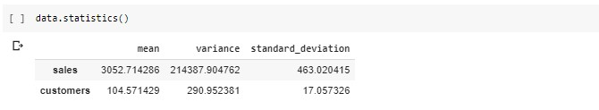
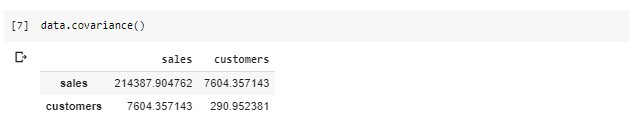
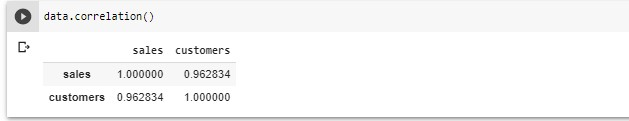

# lambdata

## statools.tools

##### stattools.tools.DataSet(*self*, data, labels=*None*)

Creates a data set object from raw Python arrays or lists of values. Converts
the data into a Pandas DataFrame object, and calculate basic descriptive
statistics, including mean, variance, standard deviation, and covariance and
correlation matrices.

Calculations are performed using bare Python, without libraries such as Numpy. 
Only uses Pandas to create DataFrame outputs. Also provides lower level to
data structures such as the generated correlation matrix.

Internally, the data set is maintained as a Python dictionary, with the key being
the column label, and the value the list of values, e.g.

'''
{'Column0': [1, 2, 3, 4...], 'Column1': [10, 11, 12, 13...], ...}
'''

*Arguments:*

data - a 2 dimensional 'array' (list) containing two or more lists of values.

labels - a list of labels for each array (i.e., column names). Optional: if 
omitted, the labels of form Column*n* will be generated automatically.

**Methods**

'''
DataSet.get_dataframe(*self*)
'''

Translates the data set into a Pandas DataFrame object.

*Arguments:*

None

*Returns:*

Pandas DataFrame object

'''
DataSet.statistics(*self*)
'''

Generates basic statistics on the data set: mean, variance, and standard deviation
of each axis.

*Arguments:*

None

*Returns*

Pandas DataFrame of object. 

'''
DataSet.covariance(*self*)
'''

Generates a variance/covariance of the data set.

*Arguments:*

None

*Returns*

Pandas DataFrame of object. 

'''
DataSet.correlation(*self*)
'''

Generates a correlation matrix of the dataset

*Arguments:*

None

*Returns*

Pandas DataFrame of object. 

**Attributes**

*DataSet.stats* - Basic statistics, as Python dictionary

*DataSet.cov_matrix* - The raw generated covariance matrix as Python nested lists

*DataSet.cor_matrix* - Raw generated correlation matrix as Python nested lists

